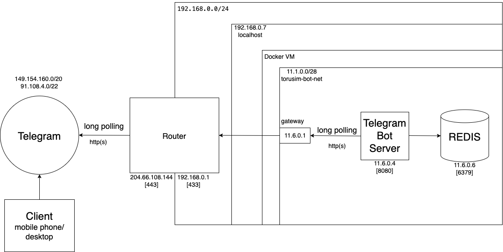

# Tourist attractions bot
Bot for finding the nearest tourist places to your location.
Attractions are loaded from https://www.openstreetmap.org/.

1. start    
     
2. send location     
     
3. choose tourism places     
     
4. press load more     
  

## Search engine     
QuadTree algorithm is used to find nearest places.   
https://en.wikipedia.org/wiki/Quadtree     
```text    
com.tourist_bot.quad.QuadTree
```

## Create bot
https://core.telegram.org/bots/tutorial    
## Telegram Bot modes

Bot can be started in 2 modes:

### LongPolling (pull mechanism).

Server periodically sends a request to Telegram, asking for new updates and keeps connection some time alive.    
After some time (30s) if no updates exist, Telegram will return an empty list, meaning that no new messages were   
sent to the bot since the last request was sent. Server sends a request again.


### WebHook (push mechanism).

Instead of asking Telegram for the updates, Telegram will immediately send all updates.


## System design

### Long Polling


Since Router doesn't need any configuration we can skip communication with it


### Web Hook


# How to use

## Data preparation

1) Go to   
   https://overpass-turbo.eu/#
2) Select an area    
   

3) copy code block to the left part and press 'run'

   ```text
   [out:json][timeout:25];
   // gather results
   (
   // query part for: “tourism=*”
   node["tourism"]({{bbox}});
   way["tourism"]({{bbox}});
   relation["tourism"]({{bbox}});
   );
   // print results
   out body;
   >;
   out skel qt;
   ```
   

4) All found points are marked on the map    
   

5) Press 'export' and select 'GeoJSON' to download data     
   
6) Use <b>com.tourist_bot.geo.TouristAttractionsDataPreparation</b> class to filter out incorrect data    
   and select only required data.
```java

        String inputFilePath = "";
        String outputFilePath = "";

        String jsonStr = Files.readString(Path.of(inputFilePath)).replace("\u00a0", "");

        ObjectMapper objectMapper = new ObjectMapper();
        JsonNode jsonNode = objectMapper.readTree(jsonStr);
        JsonNode jsonArrRaw = jsonNode.get("features");

        ArrayList<JsonNode> jsonArrayFiltered = filterTouristAttractions(jsonArrRaw.iterator());
        System.out.println(jsonArrayFiltered.size());

        ArrayList<TouristAttraction> touristAttractions = mapToTouristAttraction(jsonArrayFiltered);

        objectMapper.writerWithDefaultPrettyPrinter().writeValue(new FileWriter(outputFilePath), touristAttractions);

```

## Running bot in Intellij Idea

1) If you want to use redis as a cache service.   
   Go to dir 'local_redis' and run 'docker compose up -d'


2) Edit file 'src/main/resources/bot_conf.yaml'

- set 'app.token' with generated token
- set 'app.geoJsonPath' with generated json by class 'com.tourist_bot.geo.TouristAttractionsDataPreparation'
- set 'app.sessionManager' EMBEDDED or REDIS
- set other settings if prefer

### LongPolling mode

Run <b>com.tourist_bot.bot.LongTouristBotApp</b>

### WebHook
To run bot in a web hook mode server should be accessible from the internet.     
We can achieve it by several ways.   
#### Using Ngrok as public IP

Ngrok is a globally distributed reverse proxy that allows to expose locally hosted server to the internet.   


1) install https://ngrok.com/download
2) open console and run 
   ```shell
   ngrok http 8080 --authtoken <token>
   ```
   copy 'Forwarding host'    
        
   webHook:
   Paste  'Forwarding host' to config variable 'webHook.publicHostWebHookUrl'.   
   Add port '443' at the end. For example 'https://4a95-46-229-218-226.ngrok.io:443'.   
   Webhook can be set up only on ports [80, 88, 443 or 8443]       
3) Set config 'webHook.localHostWebHookUrl' as 'http://0.0.0.0:8080'. Only HTTP since ssl is not required with Ngrok     
4) Run com.tourist_bot.bot.WebHookTouristBotApp    
Check host address http instead of https if:     
```text
Exception in thread "main" java.lang.IllegalArgumentException: Local host is 'HTTPS': 'https://0.0.0.0:8080'. Conf 'webhook.keyStorePath' cannot be null. Or change to 'HTTP'.
	at com.tourist_bot.bot.conf.ConfLoader.load(ConfLoader.java:102)
	at com.tourist_bot.bot.WebHookTouristBotApp.main(WebHookTouristBotApp.java:71)
```


#### Using router's static or dynamic IP.


#### Generate Pem certificate
Get your ROUTER_IP. Use  https://whatismyipaddress.com/
Generate JKS certificate:

```shell
# replace ROUTER_IP with real ip
openssl req -newkey rsa:2048 -sha256 -nodes -keyout YOURPRIVATE.key -x509 -days 365 -out YOURPUBLIC.pem -subj "/C=US/ST=New York/L=Brooklyn/O=Example Brooklyn Company/CN=ROUTER_IP"

openssl pkcs12 -export -in YOURPUBLIC.pem -inkey YOURPRIVATE.key -out certificate.p12 -name "certificate"
# Enter Export Password: <keyStorePassword>  any number of characters but at least 6 characters
# Verifying - Enter Export Password: <keyStorePassword>

keytool -importkeystore -srckeystore certificate.p12 -srcstoretype pkcs12 -destkeystore cert.jks  
# Enter destination keystore password: <keyStorePassword>
# Re-enter new password: <keyStorePassword>
# Enter source keystore password: <keyStorePassword>
```

1) You have to configure Port Address Translation (PAT) on your router device.
   Port 8443 should be mapped to 8070
2) Set config 'webhook.publicPemPath' as path to 'YOURPUBLIC.pem' <b>see Generate Pem certificate</b>
3) Set config 'webhook.keyStorePath' as path to 'cert.jks'.  <b>see Generate Pem certificate</b>
4) Set config 'webhook.keyStorePassword' as value that was typed during 'keytool' command. <b>see Generate Pem certificate</b>
5) Set config 'webhook.localHostWebHookUrl' as 'https://0.0.0.0:8070'. http(S). REQUIRED HTTP(S)!!!!!!   
6) Set config 'webhook.publicHostWebHookUrl' as 'https://ROUTER_IP:8443'. http(S). REQUIRED HTTP(S)!!!!!!
7) Run com.tourist_bot.bot.WebHookTouristBotApp
8) Check that port is available https://www.yougetsignal.com/tools/open-ports/
   


# Running bot in docker cluster
## Create Image
cd to dir 'docker_cluster'    
execute     
```shell
chmod +x ./build.sh
./build.sh
```
## Running Long polling mode
      
put 'generated json' from step [Data preparation] as file to volume/bot/conf/tourist_places.geojson     
Set 'TELE_BOT_APP_TOKEN' inside  long/docker-compose_long.yml    
Run
```shell 
./deploy.sh long start
```

## Running Ngrok as a public host
      
put 'generated json' from step [Data preparation] as file to volume/bot/conf/tourist_places.geojson
set 'TELE_BOT_APP_TOKEN' and 'NGROK_AUTHTOKEN' inside webhook/ngrok/docker-compose_ngrok.yml
Run    
```shell
./deploy.sh ngrok start
```

## Running webhook with static host
      
put 'generated json' from step [Data preparation] as file to volume/bot/conf/tourist_places.geojson    
set 'TELE_BOT_APP_TOKEN' inside webhook/static/docker-compose_static.yml
Run    
```shell
./deploy.sh static start
```

# Deploy bot on kubernetes cluster
## Minikube
replace <project_path> and run
```shell
minikube start --mount-string="<project_path>/telegram-tourist-bot/kube_cluster:/host_volume_dir" --mount
minikube image  load  keks/tourist-bot:1.0
```

## Helm
All helms are placed ./telegram-tourist-bot/kube_cluster/tourist_bot  
Set variables in each  <b>values.yaml</b> before install    

If <b>ErrImageNeverPull</b> 
1. First approach
   ```text
   Events:
     Type     Reason             Age               From               Message
     ----     ------             ----              ----               -------
     Normal   Scheduled          17s               default-scheduler  Successfully assigned default/long-bot-deploy-h-c8f9599cb-cznjn to server
     Warning  ErrImageNeverPull  2s (x3 over 17s)  kubelet            Container image "keks/tourist-bot:1.0" is not present with pull policy of Never
     Warning  Failed             2s (x3 over 17s)  kubelet            Error: ErrImageNeverPull
   ```
   kubectl get nodes -o wide
   ```text
   NAME     STATUS   ROLES           AGE   VERSION   INTERNAL-IP   EXTERNAL-IP   OS-IMAGE             KERNEL-VERSION      CONTAINER-RUNTIME
   server   Ready    control-plane   19d   v1.28.2   192.168.0.9   <none>        Ubuntu 22.04.3 LTS   5.15.0-89-generic   containerd://1.6.14
   ```
   If CONTAINER-RUNTIME  <b>containerd</b>
   ```shell
   docker save keks/tourist-bot:1.0 -o tourist-bot.tar
   sudo ctr -n k8s.io image import tourist-bot.tar
   sudo ctr -n k8s.io image ls | grep tour
   # docker.io/keks/tourist-bot:1.0
   ```
2. Second approach     
   use local registry to push and pull images    
